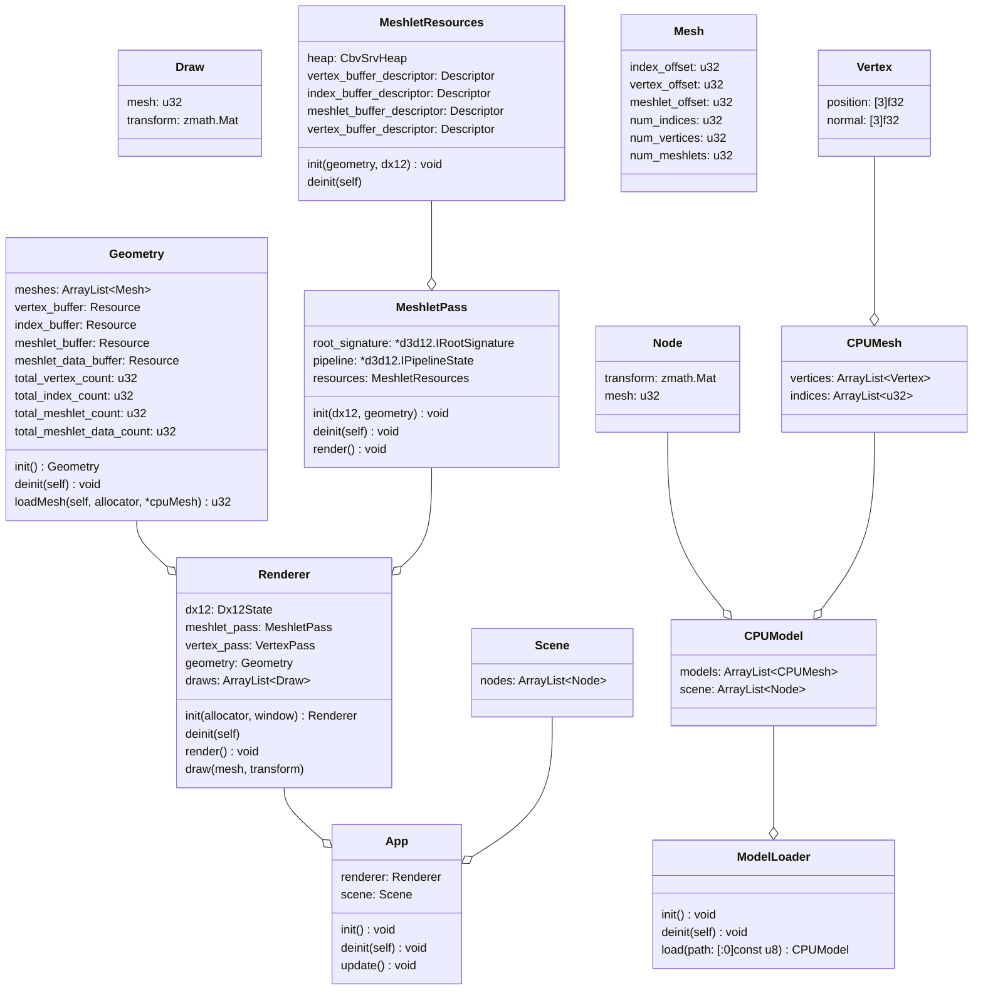

```mermaid
classDiagram
direction TB
    class Geometry {
	    meshes: ArrayList~Mesh~
	    vertex_buffer: Resource
	    index_buffer: Resource
	    meshlet_buffer: Resource
	    meshlet_data_buffer: Resource
	    total_vertex_count: u32
	    total_index_count: u32
	    total_meshlet_count: u32
	    total_meshlet_data_count: u32
	    init() Geometry
	    deinit(self) void
	    loadMesh(self, allocator, *cpuMesh) u32
    }

	class Draw {
		mesh: u32
		transform: zmath.Mat
	}

    class Renderer {
	    dx12: Dx12State
	    meshlet_pass: MeshletPass
	    vertex_pass: VertexPass
	    geometry: Geometry
		draws: ArrayList~Draw~

	    init(allocator, window) Renderer
	    deinit(self)

	    render() void
  
		draw(mesh, transform)
    }

    class MeshletPass {
	    root_signature: *d3d12.IRootSignature
	    pipeline: *d3d12.IPipelineState
	    resources: MeshletResources
	    init(dx12, geometry) void
	    deinit(self) void
	    render() void
    }

    class MeshletResources {
	    heap: CbvSrvHeap
	    vertex_buffer_descriptor: Descriptor
	    index_buffer_descriptor: Descriptor
	    meshlet_buffer_descriptor: Descriptor
	    vertex_buffer_descriptor: Descriptor
	    init(geometry, dx12) void
	    deinit(self)
    }

    class Mesh {
	    index_offset: u32
	    vertex_offset: u32
	    meshlet_offset: u32
	    num_indices: u32
	    num_vertices: u32
	    num_meshlets: u32
    }

	class CPUMesh {
		vertices: ArrayList~Vertex~
		indices: ArrayList~u32~
	}

	class Node {
		transform: zmath.Mat
		mesh: u32
	}

	class CPUModel {
		models: ArrayList~CPUMesh~
		scene: ArrayList~Node~
	}

    class Vertex {
        position: [3]f32
        normal: [3]f32
    }

	class Scene {
		nodes: ArrayList~Node~
	}

    %% Loads meshes, loads scene
    %% Loads CPU mesh data as Vertex and index arrays, to be passed to renderer where it is converted to meshlets
    class ModelLoader {
	    init() void
	    deinit(self) void

        load(path: [:0]const u8) CPUModel
    }

    class App {
        renderer: Renderer
		scene: Scene

        init() void
        deinit(self) void

        update() void
    }

	Vertex --o CPUMesh
	Node --o CPUModel
	CPUMesh --o CPUModel
	CPUModel --o ModelLoader
    Renderer --o App
    Scene --o App
    Geometry --o Renderer
    MeshletPass --o Renderer
    MeshletResources --o MeshletPass
```